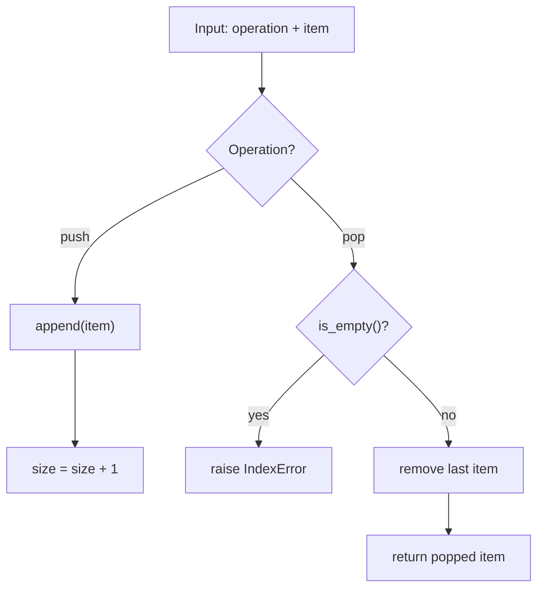
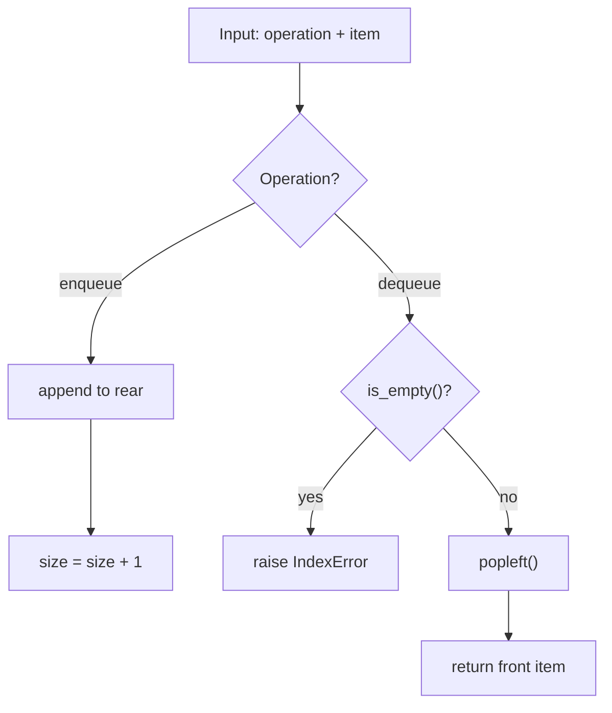
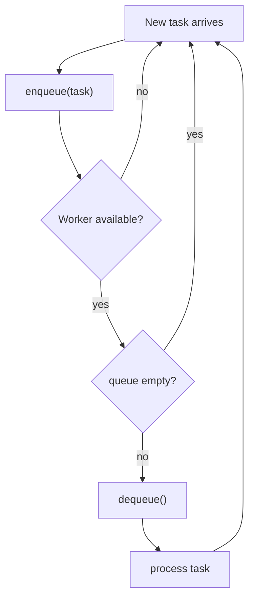
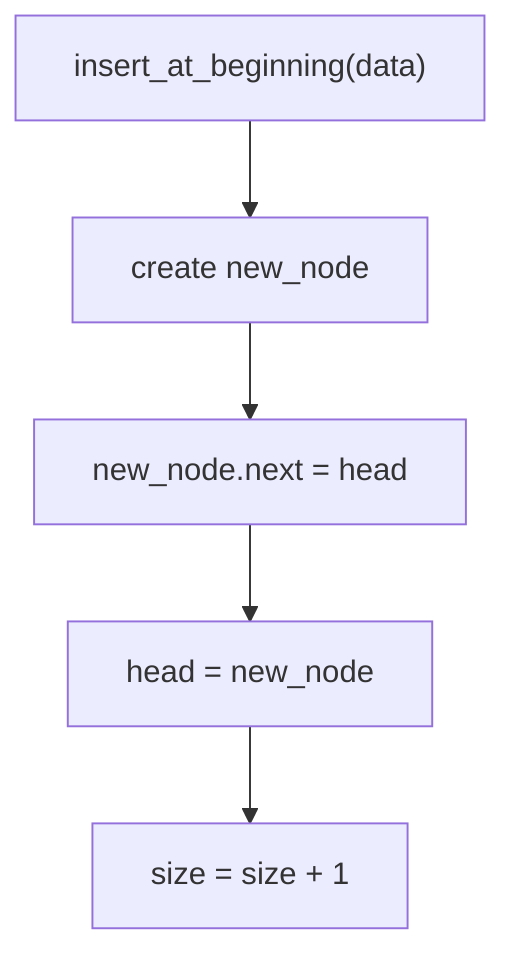
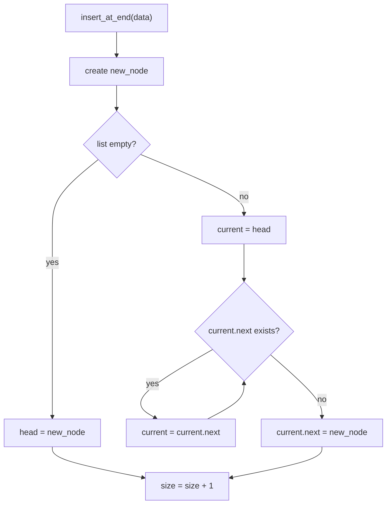
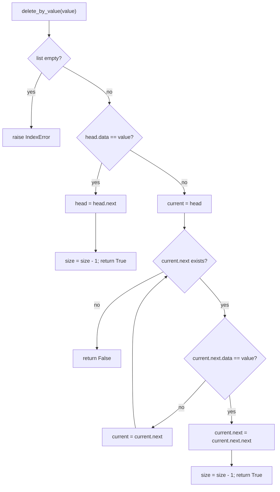
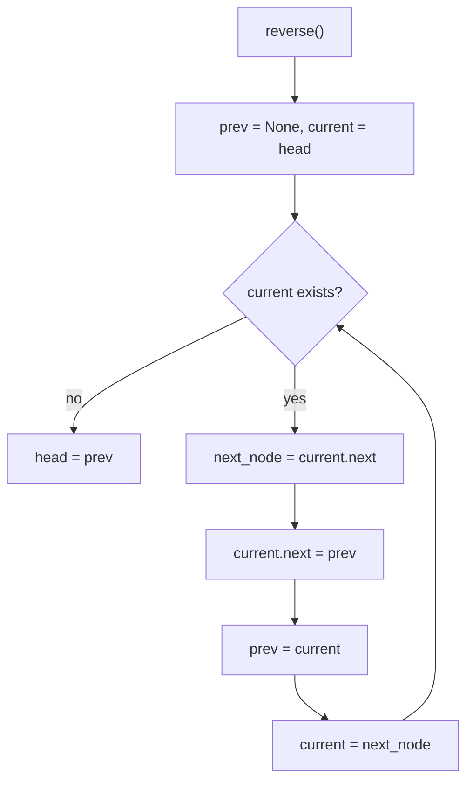

# Week 01 Lecture Notes

## Topic
- Stack
- Queue
- Singly Linked List

## Learning Goals
- Understand how each structure stores and organizes data.
- Explain LIFO and FIFO behavior clearly.
- Implement and use core operations in Python.
- Compare time-cost tradeoffs for common operations.
- Choose the right structure for a small real-life problem.

## In-Class Code References
- `week-01/src/1-stack.py`
- `week-01/src/2-queue.py`
- `week-01/src/3-linked_list.py`

## Stack (LIFO: Last In, First Out)
- Think of a stack of plates: last plate added is the first removed.
- Best when you need to remember recent actions first.
- Core operations:
  - `push(item)`: add to top
  - `pop()`: remove and return top
  - `peek()`: read top without removing
  - `is_empty()`, `size()`
- Typical use cases:
  - Undo/redo systems
  - Parentheses matching
  - Backtracking

### Stack Workflow
- `push(item)` adds to top; `pop()` removes from top.
- Empty-check is required before `pop()`.
- Balanced-parentheses uses push/pop matching.

## Queue (FIFO: First In, First Out)
- Think of a line at a ticket counter: first person in line is served first.
- Best for scheduling and ordered processing.
- Core operations:
  - `enqueue(item)`: add to rear
  - `dequeue()`: remove from front
  - `front()`: read front without removing
  - `is_empty()`, `size()`
- This week implementation uses Python `deque` for efficient front removal.

### Queue Workflow
- `enqueue(item)` adds at rear.
- `dequeue()` removes from front.
- Queue processing repeats until empty.

## Singly Linked List
- A linked list is made of nodes.
- Each node contains:
  - `data`
  - `next` (reference to next node)
- Good when dynamic insertions/deletions matter more than direct indexing.
- Core operations from this week:
  - Insert: beginning, end, position
  - Delete: beginning, end, by value
  - Search by value
  - Reverse list
  - Display list

### Linked List Workflow
- Insert at beginning is pointer reassignment at `head`.
- Insert at end requires traversal when no tail pointer exists.
- Delete by value reconnects links to skip target node.
- Reverse rewires all `next` pointers iteratively.

## Quick Complexity Notes
- Stack:
  - `push`, `pop`, `peek`: usually `O(1)`
- Queue (`deque`):
  - `enqueue`, `dequeue`, `front`: `O(1)`
- Singly Linked List:
  - Insert/delete at beginning: `O(1)`
  - Insert at end (without tail): `O(n)`
  - Search/access by position: `O(n)`

## Compare: When to Use Which
- Use **Stack** when latest item should be handled first.
- Use **Queue** when oldest item should be handled first.
- Use **Linked List** when many inserts/deletes happen and random indexing is not the priority.

## Further Reading Notes
- Python docs: `collections.deque` and why it is efficient for queues.
- Visual learning: VisuAlgo simulations for stack, queue, and linked list.
- Book chapter suggestion: Data structures chapter from *Problem Solving with Algorithms and Data Structures using Python*.
- Practice sites:
  - LeetCode easy stack/queue problems
  - HackerRank linked list exercises

## Homework
- Easy:
  - Build a mini browser history using a stack.
  - Features: `visit(url)`, `back()`, `current()`.
- Moderate:
  - Build a print queue simulator.
  - Input: list of print jobs with page counts.
  - Output: processing order and total waiting time.
- Difficult:
  - Build a text-editor undo/redo prototype using two stacks.
  - Required actions: `type(text)`, `undo()`, `redo()`.
  - Add a short complexity note for each action.

## Next Week Topic (Brief)
- Next week we will start **Trees** and **Binary Search Trees (BST)**.
