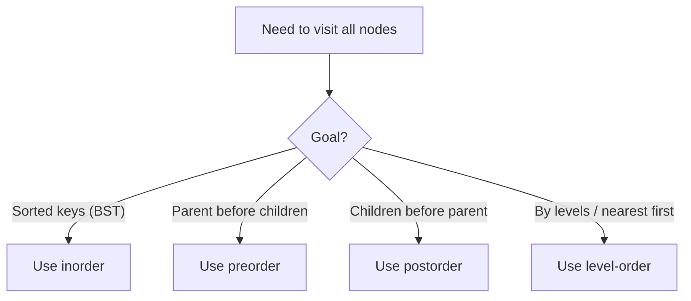
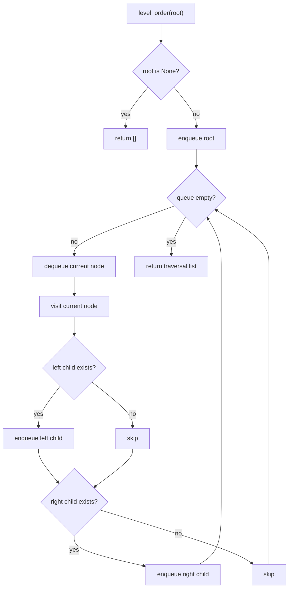
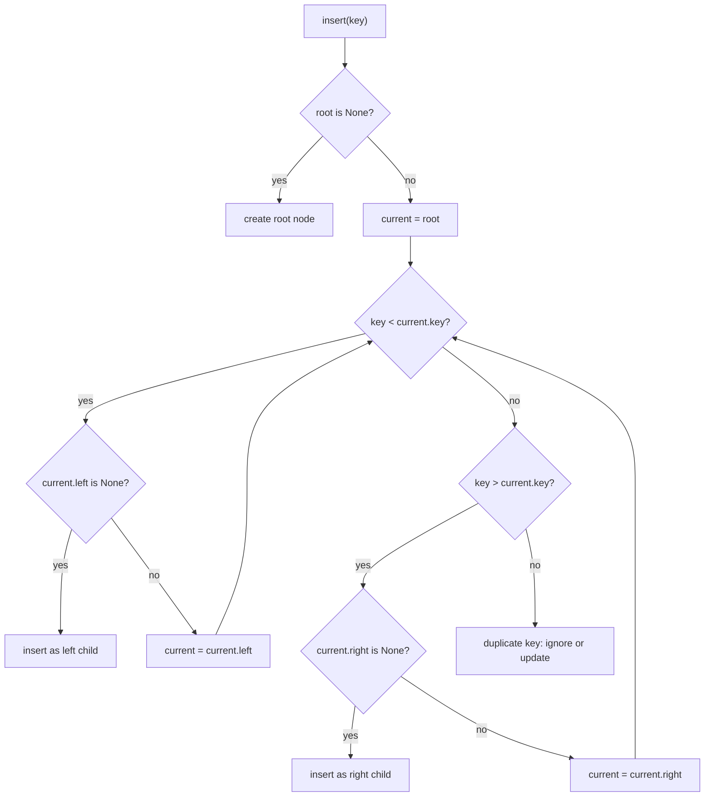
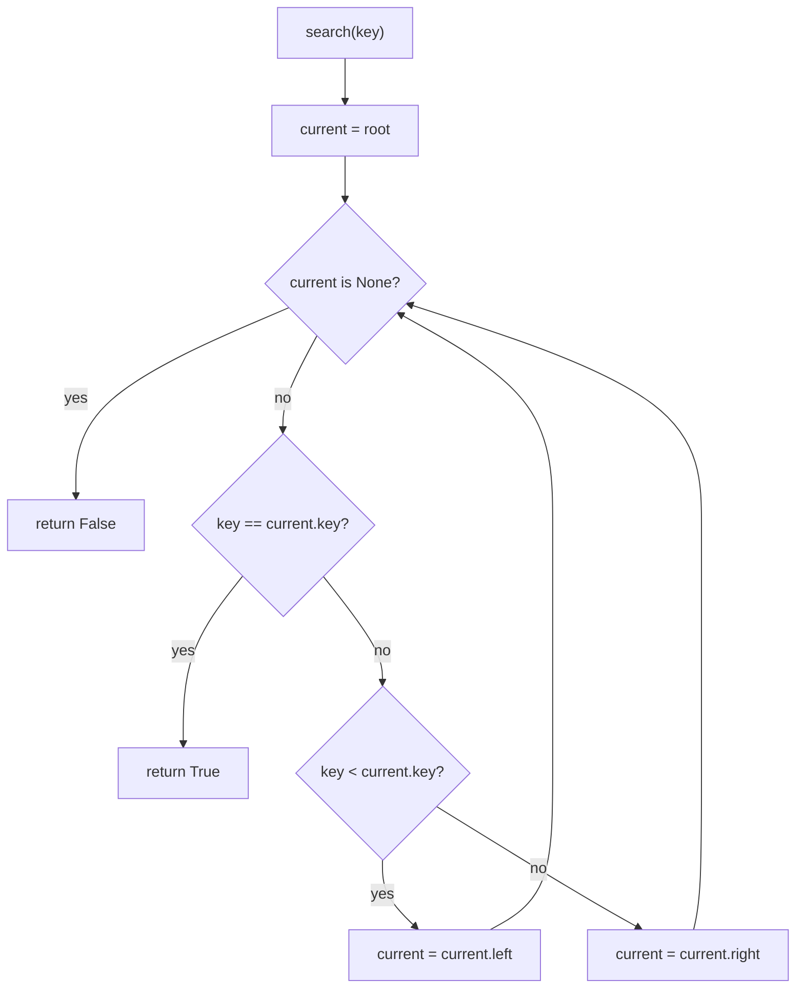
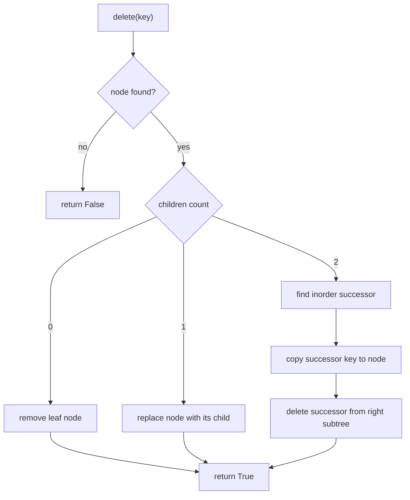

# Week 02 Lecture Notes

## Topic
- Trees
- Binary Search Trees (BST)

## Learning Goals
- Explain how tree structures represent hierarchical data.
- Use tree terminology correctly (root, child, leaf, height, depth).
- Trace and implement tree traversals.
- Understand BST ordering rules and why they improve search.
- Implement core BST operations in Python.

## In-Class Code References
- `weeks/week-02/src/1-trees.py`
- `weeks/week-02/src/2-binary_search_tree.py`

## Trees: Core Concepts
- A tree is a non-linear data structure.
- Data is stored in nodes connected by edges.
- Trees model hierarchy (folders, org charts, decision paths).

### Tree Terminology
- `root`: top node
- `parent`: node with child nodes
- `child`: node connected below a parent
- `leaf`: node with no children
- `subtree`: tree formed by a node and its descendants
- `depth`: distance from root to a node
- `height`: longest path from node to a leaf

### Tree Traversal Types
- `preorder`: root -> left -> right
- `inorder`: left -> root -> right
- `postorder`: left -> right -> root
- `level-order`: visit nodes level by level (BFS)

### Traversal Workflow
- Traversal choice depends on goal:
  - Need sorted output in BST -> use `inorder`
  - Need to copy/serialize tree structure -> use `preorder`
  - Need to process children before parent -> use `postorder`
  - Need shortest-level exploration -> use `level-order`

## Binary Search Trees (BST): Core Concepts
- BST is a special binary tree with an ordering rule:
  - Left subtree values are smaller than node value.
  - Right subtree values are greater than node value.
- This rule makes search and insertion efficient in balanced cases.

### BST Insert Workflow
- Start from root.
- Compare target value with current node.
- Move left or right based on comparison.
- Insert when you find an empty child reference.

### BST Search Workflow
- Start at root.
- Compare target with current node.
- Keep going left/right until found or reach `None`.

### BST Delete Workflow
- Three delete cases:
  - Node has no child (leaf) -> remove directly
  - Node has one child -> connect parent to that child
  - Node has two children -> replace with inorder successor (minimum in right subtree), then delete successor

## Complexity Notes
- Trees (general traversal):
  - Traversal time: `O(n)`
  - Extra space:
    - DFS recursion stack: `O(h)`
    - BFS queue: `O(w)` (`w` = max width)
- BST:
  - Average (roughly balanced):
    - `insert`, `search`, `delete`: `O(log n)`
  - Worst case (skewed):
    - `insert`, `search`, `delete`: `O(n)`

## Common Mistakes
- Forgetting base cases in recursive traversal.
- Mixing up traversal orders.
- Ignoring duplicate-key policy in BST.
- Forgetting to update tree root after delete.

## Further Reading Notes
- Python docs for `collections.deque` (used in level-order traversal).
- Visual references: tree traversal animations.
- Extension topic: self-balancing BSTs (AVL and Red-Black Trees).

## Homework
- Easy:
  - Build a small binary tree manually and print all traversal outputs.
  - Compare `preorder`, `inorder`, and `postorder` results.
- Moderate:
  - Implement a function that checks if a binary tree is height-balanced.
  - Return `True` or `False`.
- Difficult:
  - Build a BST from a list of numbers and implement:
    - `insert`, `search`, `delete`
    - `find_min`, `find_max`
  - Add complexity notes for best/average/worst cases.

## Next Week Topic (Brief)
- Next week we can move to tree applications or balanced trees.
