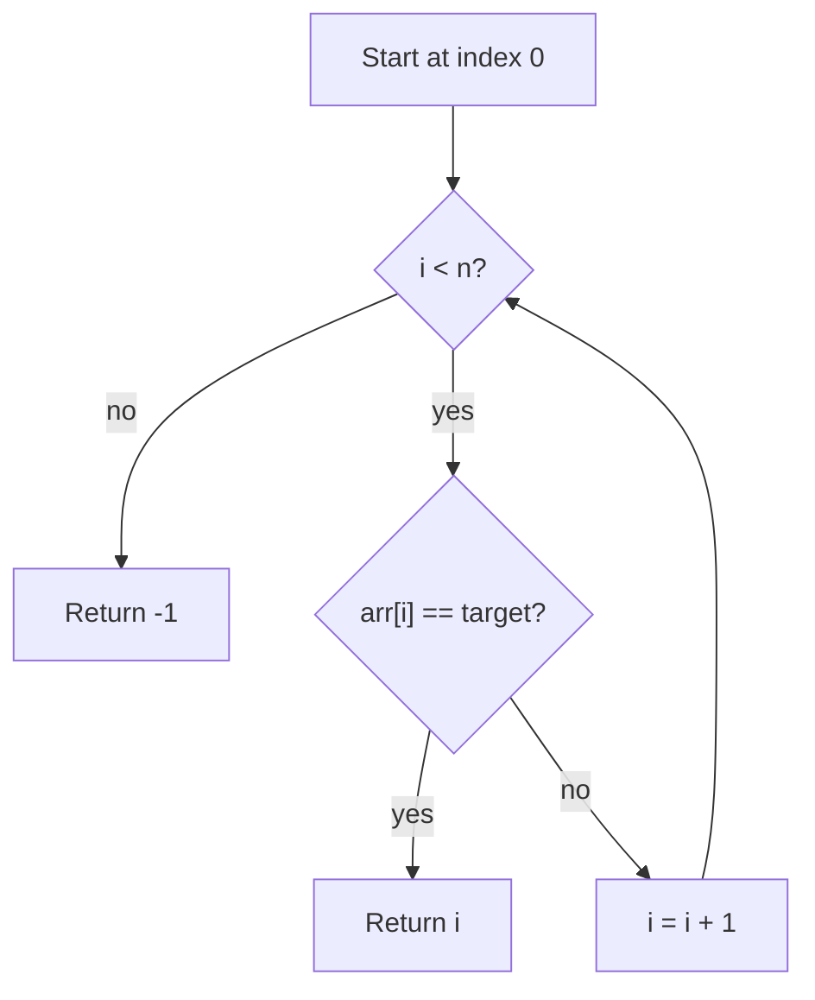
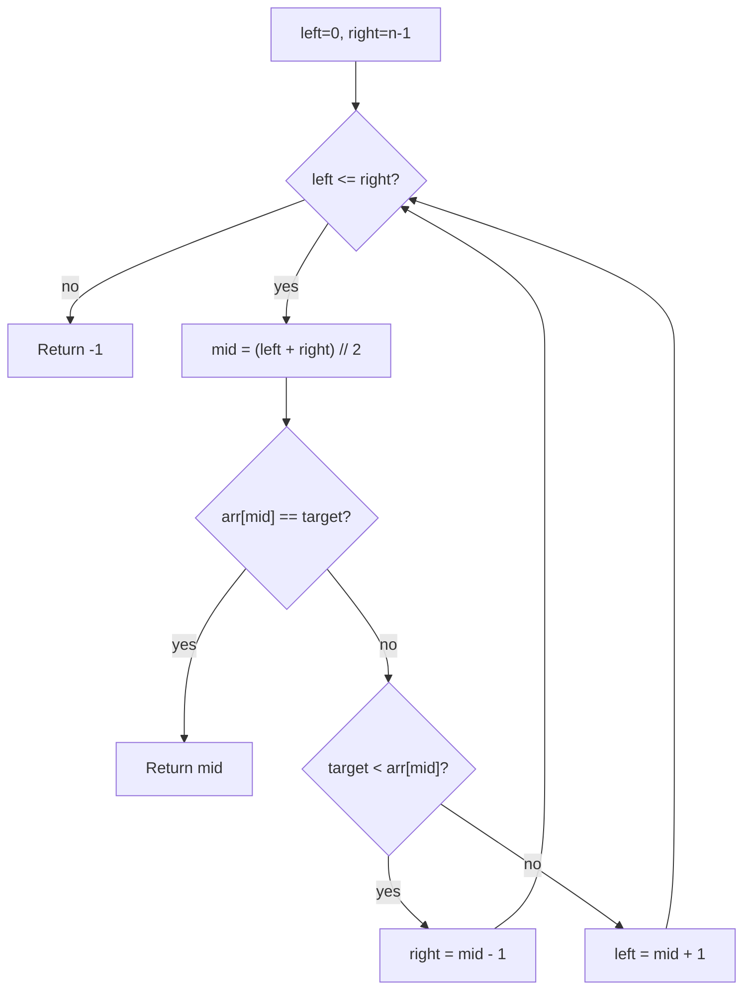
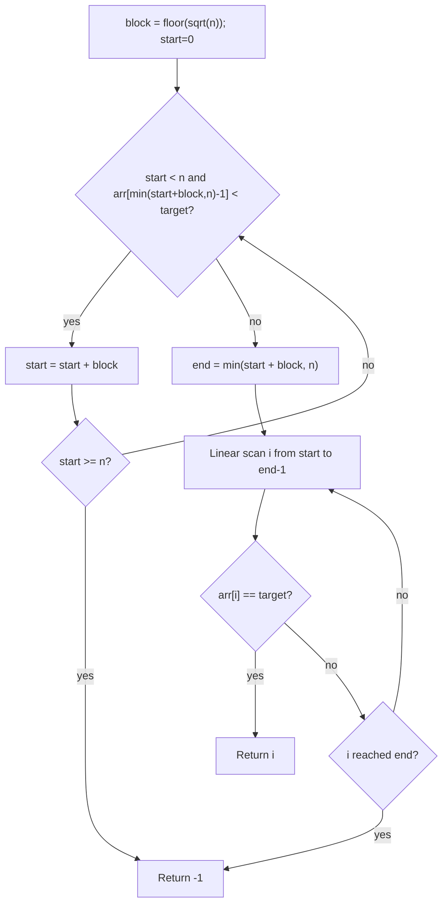
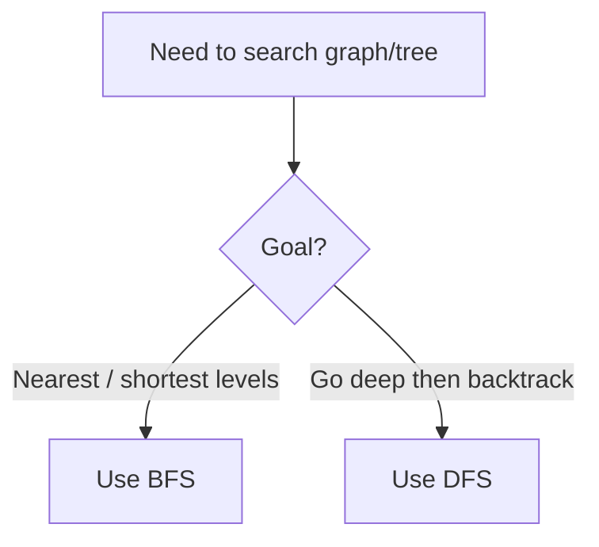

# Week 03 Lecture Notes

## Topic
- Linear Search
- Binary Search
- Jump Search

## Learning Goals
- Understand why different search strategies have different costs.
- Implement linear, binary, and jump search in Python.
- Explain sorted-input preconditions for binary and jump search.

## In-Class Code References
- `weeks/week-03/src/1-linear_search.py`
- `weeks/week-03/src/2-binary_search.py`
- `weeks/week-03/src/3-jump_search.py`

## Linear Search
- Scans the array from left to right.
- Works on both sorted and unsorted arrays.
- Best for:
  - Small inputs
  - One-time lookup
  - Unsorted data

### Linear Search Workflow

## Binary Search
- Requires a sorted array.
- Repeatedly halves the search space.
- Best for:
  - Large sorted data
  - Fast repeated lookups

### Binary Search Workflow

## Jump Search
- Requires a sorted array.
- Jumps in blocks, then does local linear scan.
- Common block size: `sqrt(n)`.
- Good as a bridge concept between linear and binary thinking.

### Jump Search Workflow

## Compare: Which Search to Use
- Use **Linear Search** when:
  - Data is unsorted
  - Input size is small
- Use **Binary Search** when:
  - Data is sorted
  - You need efficient lookups
- Use **Jump Search** when:
  - Data is sorted
  - You want a simple block-based strategy

## Complexity Notes
- Linear Search:
  - Time: `O(n)`
- Binary Search:
  - Time: `O(log2(n))`
- Jump Search:
  - Time: `O(sqrt(n))`

## Further Reading
- Python documentation for list operations and indexing.
- Visual algorithm animations for search strategies.
- Bridge topic: BFS and DFS as search on graph structures.

## Homework
- Easy:
  - Implement linear search and test it with at least 5 arrays.
- Moderate:
  - Implement iterative binary search with sorted-input validation.
- Difficult:
  - Implement jump search and compare operation counts against linear and binary search.

## Next Week Teaser (BFS/DFS)
- Next week we move from searching arrays to searching graphs.
- BFS and DFS choose different exploration orders.

