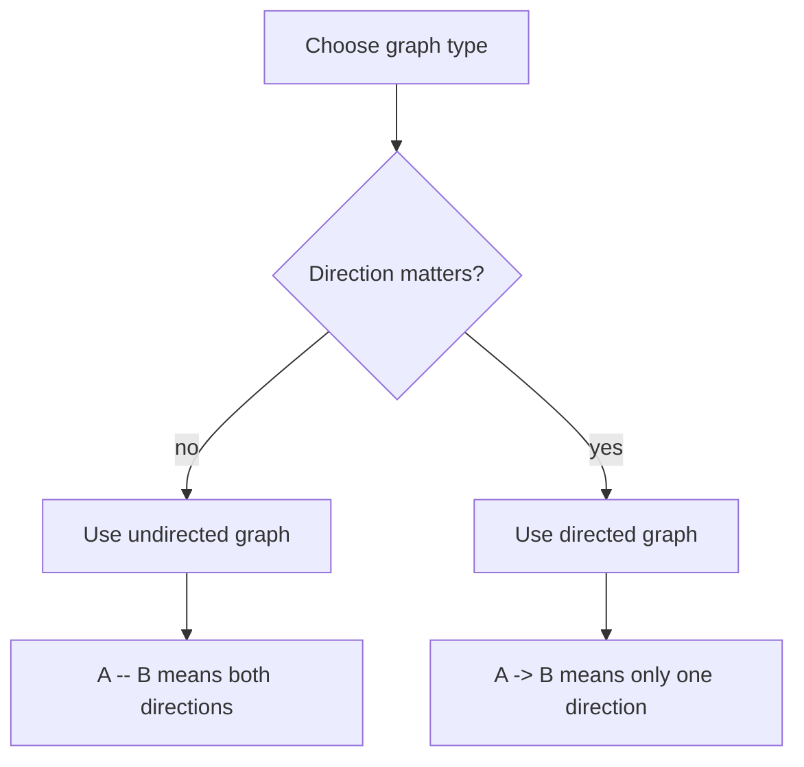
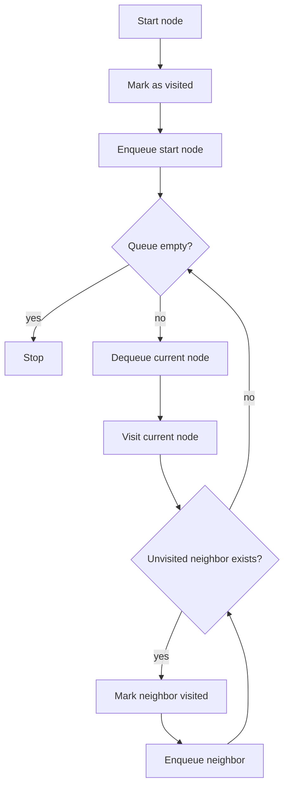
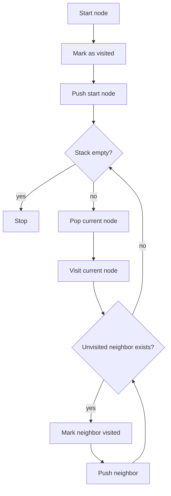
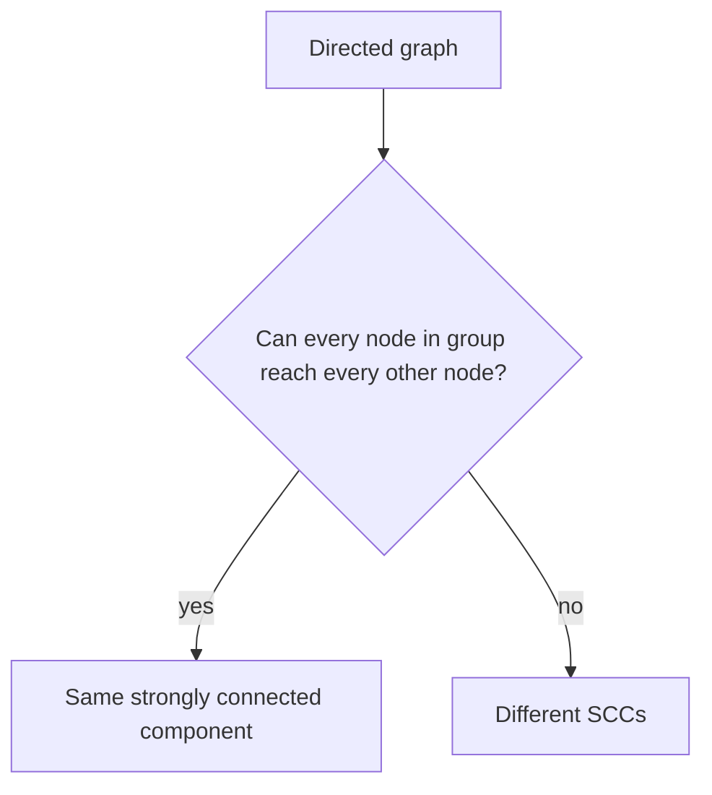

# Week 04 Lecture Notes

## Topic
- Graph Basics
- Breadth-First Search (BFS)
- Depth-First Search (DFS)
- Connected Components
- Strongly Connected Components (SCC)

## Learning Goals
- Explain what a graph is using the terms node, edge, neighbor, path, and cycle.
- Distinguish directed and undirected graphs.
- Implement BFS and DFS in Python using adjacency lists.
- Identify connected components in undirected graphs.
- Understand what strongly connected components mean in directed graphs.

## In-Class Code References
- `weeks/week-04/src/1-graph_basics.py`
- `weeks/week-04/src/2-bfs.py`
- `weeks/week-04/src/3-dfs.py`
- `weeks/week-04/src/4-strongly_connected_components.py`

## Graph Basics
- A graph is a collection of:
  - `nodes` (also called vertices)
  - `edges` connecting nodes
- Graphs are useful for roads, social networks, the web, maps, and dependency systems.

### Core Vocabulary
- `node`: one point or object in the graph
- `edge`: one connection between two nodes
- `neighbor`: a node directly connected to another node
- `path`: a sequence of nodes connected by edges
- `cycle`: a path that returns to its starting node
- `component`: a group of nodes that are connected to each other

### Directed vs Undirected
- In an **undirected graph**, an edge means two-way connection.
  - Example: friendship, two-way road
- In a **directed graph**, an edge has direction.
  - Example: Instagram follow, one-way street



## Graph Representation
- This week we use an **adjacency list**.
- Example:

```python
graph = {
    "A": ["B", "C"],
    "B": ["A", "D"],
    "C": ["A"],
    "D": ["B"]
}
```

- Read it as:
  - from `A`, you can go to `B` and `C`
  - from `B`, you can go to `A` and `D`

## Breadth-First Search (BFS)
- BFS explores **level by level**.
- It uses a **queue**.
- BFS is a good choice when:
  - you want the shortest path in an **unweighted** graph
  - you want to visit nearest nodes first

### BFS Workflow


## Depth-First Search (DFS)
- DFS explores **as deep as possible first**.
- It uses:
  - a **stack**, or
  - **recursion**
- DFS is useful when:
  - you want to explore structure deeply
  - you need backtracking behavior
  - you want to find components, cycles, or traversal order

### DFS Workflow


## Connected Components
- In an **undirected graph**, a connected component is a maximal group of nodes where every node can reach every other node.
- If a graph has multiple disconnected groups, it has multiple connected components.

### Component Idea
- Example:
  - `{A, B, C}` is one component
  - `{D, E}` is another component
  - `{F}` alone is an isolated component

## Strongly Connected Components (SCC)
- SCC is a concept for **directed graphs**.
- A strongly connected component is a maximal group of nodes where:
  - every node can reach every other node
  - and the reachability must respect edge direction

### SCC Intuition
- In a directed cycle like `A -> B -> C -> A`, all three nodes belong to one SCC.
- If `C -> D` exists but there is no path back from `D` to `A`, then `D` is not in the same SCC as `A, B, C`.



## Compare: BFS vs DFS
- Use **BFS** when:
  - nearest nodes matter
  - shortest path in an unweighted graph matters
  - level-by-level exploration is helpful
- Use **DFS** when:
  - deep exploration matters
  - backtracking is natural
  - structure analysis is the goal

## Complexity Notes
- Graph storage with adjacency list:
  - Space: `O(V + E)`
- BFS:
  - Time: `O(V + E)`
  - Extra space: `O(V)`
- DFS:
  - Time: `O(V + E)`
  - Extra space: `O(V)`
- Connected components:
  - Time: `O(V + E)`
- SCC with Kosaraju-style idea:
  - Time: `O(V + E)`

## Common Mistakes
- Forgetting the `visited` set and revisiting the same nodes forever.
- Mixing up queue behavior and stack behavior.
- Treating SCC as the same thing as connected component.
- Forgetting that SCC only applies to directed graphs.
- Building adjacency lists inconsistently for undirected graphs.

## Further Reading Notes
- BFS and DFS on maze solving.
- Network analysis with connected components.
- Graph modeling in maps, recommendations, and routing systems.
- Bridge topic for later:
  - shortest paths
  - minimum spanning trees
  - topological sorting

## Homework
- Easy:
  - Build a small undirected graph with 6 nodes and print its adjacency list.
  - Run BFS from one start node and print the visit order.
- Moderate:
  - Implement DFS and a function that returns all connected components.
- Difficult:
  - Build a directed graph and implement strongly connected components.
  - Explain why two nodes are in the same SCC or not.

## Next Week Topic (Brief)
- Next week can move to shortest paths on graphs or sorting algorithms.
