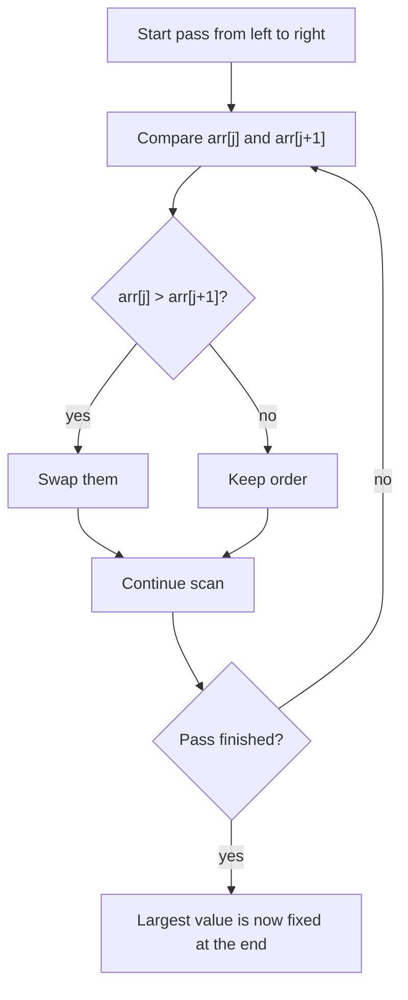
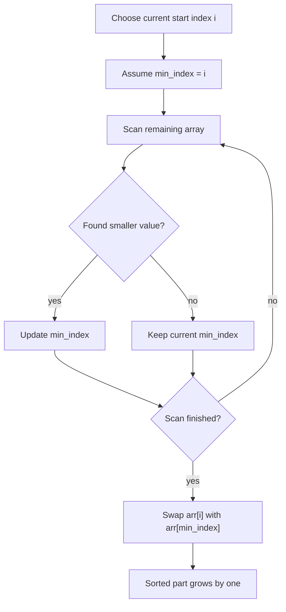
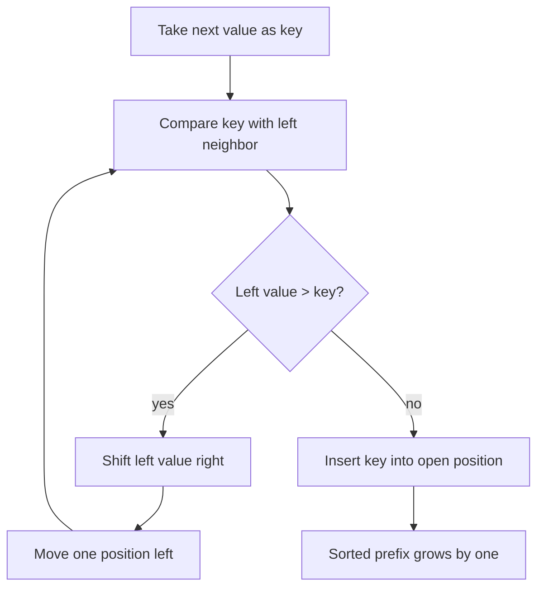

# Week 05 Lecture Notes

## Topic
- Bubble Sort
- Selection Sort
- Insertion Sort

## Learning Goals
- Explain what sorting means and why sorted data is useful.
- Implement three simple sorting algorithms in Python.
- Compare swap-based, selection-based, and insertion-based sorting behavior.
- Trace how the sorted portion of an array grows over time.
- Connect algorithm steps to time complexity and common tradeoffs.

## In-Class Code References
- `weeks/week-05/src/1-bubble_sort.py`
- `weeks/week-05/src/2-selection_sort.py`
- `weeks/week-05/src/3-insertion_sort.py`
- `weeks/week-05/src/practice.py`

## Why Sorting Matters
- Sorting arranges data in a meaningful order.
- Common reasons to sort:
  - prepare data for faster searching
  - display values clearly
  - rank items by size, score, or time
  - make duplicates or patterns easier to spot

## Bubble Sort
- Bubble sort repeatedly compares neighboring values.
- If two neighbors are in the wrong order, it swaps them.
- After each pass, the largest unsorted value moves to the end.
- Good for teaching comparison and swapping, but not efficient for large lists.

### Bubble Sort Workflow

## Selection Sort
- Selection sort finds the minimum value from the unsorted part.
- It then swaps that minimum value into the next sorted position.
- After each pass, the sorted part grows from the left.
- It performs fewer swaps than bubble sort, but still scans a lot.

### Selection Sort Workflow

## Insertion Sort
- Insertion sort grows a sorted prefix on the left.
- It takes the next value and inserts it into the correct place in that sorted part.
- It is often simple and efficient for small or nearly sorted data.
- Instead of many random swaps, it shifts larger values right.

### Insertion Sort Workflow

## Compare: How They Think
- **Bubble Sort**
  - local neighbor comparisons
  - largest value drifts right each pass
- **Selection Sort**
  - find one minimum, place it once
  - sorted part grows from the left
- **Insertion Sort**
  - maintain sorted prefix
  - insert next value into its correct position

## Complexity Notes
- Bubble Sort:
  - Worst/Average: `O(n^2)`
  - Best with early-stop optimization: `O(n)`
- Selection Sort:
  - Best/Average/Worst: `O(n^2)`
- Insertion Sort:
  - Worst/Average: `O(n^2)`
  - Best on nearly sorted input: `O(n)`
- All three typically use:
  - Extra space: `O(1)` if sorting in place

## Common Mistakes
- Forgetting to shorten the unsorted range after each pass.
- Swapping too early in selection sort instead of waiting for the minimum.
- Losing the `key` value during insertion sort.
- Mixing up “swap” and “shift”.
- Assuming all `O(n^2)` algorithms behave the same in practice.

## When to Use Which
- Use **Bubble Sort** mainly for learning and tracing.
- Use **Selection Sort** when you want a simple algorithm with few swaps.
- Use **Insertion Sort** when the input is small or already almost sorted.

## Further Reading Notes
- Python built-in `sorted()` uses much more advanced ideas than these algorithms.
- These three algorithms are useful stepping stones before:
  - merge sort
  - quicksort
  - heap sort

## Homework
- Easy:
  - Implement bubble sort and print the array after each pass.
- Moderate:
  - Compare bubble sort and selection sort on the same 10-element list.
  - Count comparisons and swaps.
- Difficult:
  - Implement insertion sort and explain why it performs well on nearly sorted data.
  - Test it on a sorted list, a reversed list, and a random list.

## Next Week Topic (Brief)
- Next week can move to divide-and-conquer sorting such as merge sort and quicksort.
