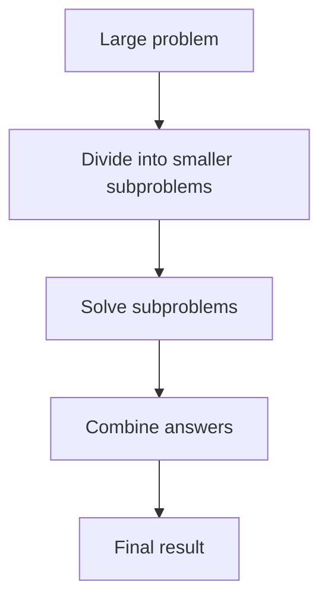
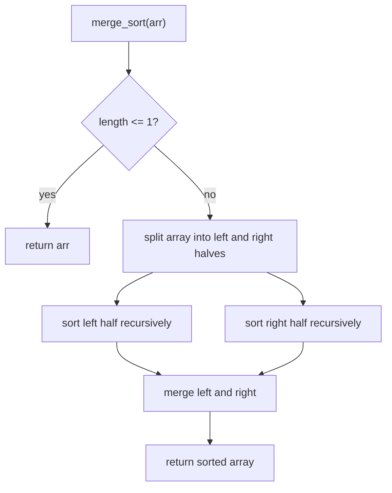
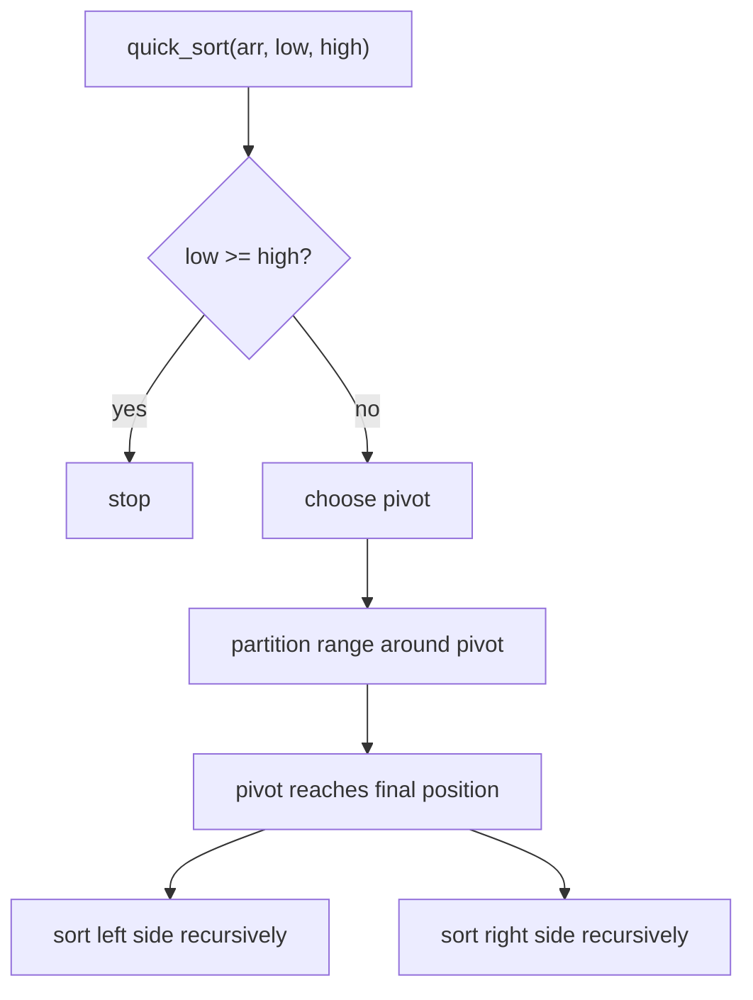

# Week 06 Lecture Notes

## Topic
- Divide and Conquer
- Merge Sort
- Quick Sort

## Learning Goals
- Explain the divide-and-conquer idea clearly.
- Implement merge sort and quick sort in Python.
- Compare merge sort and quick sort with the simple sorting algorithms from Week 05.
- Understand the ideas of split, merge, pivot, and partition.
- Relate recursion structure to time complexity.

## In-Class Code References
- `weeks/week-06/src/1-merge_sort.py`
- `weeks/week-06/src/2-quick_sort.py`

## Why This Week Matters
- Week 05 focused on simple `O(n^2)` sorting methods.
- Week 06 focuses on faster sorting ideas for larger inputs.
- The key new idea is **divide and conquer**:
  - divide the problem into smaller parts
  - solve those parts
  - combine the result

## Divide and Conquer
- A large problem is often easier after splitting it.
- This pattern appears often in recursive algorithms.

## Merge Sort
- Merge sort repeatedly splits the array into two halves.
- Arrays of length 1 are already sorted.
- After sorting the halves, it merges them back into a sorted result.
- Merge sort is predictable and stable, but it uses extra memory while merging.

### Merge Sort Workflow

## Quick Sort
- Quick sort chooses a pivot.
- It partitions the array so smaller values go to one side and larger values go to the other side.
- Then it recursively sorts the two sides.
- Quick sort is often very fast in practice, but bad pivot choices can lead to bad performance.

### Quick Sort Workflow

## Compare: Merge Sort vs Quick Sort
- **Merge Sort**
  - splits by half
  - combines with merge
  - reliable `O(n log n)` time
  - needs extra merge space
- **Quick Sort**
  - partitions around a pivot
  - average `O(n log n)` time
  - worst case `O(n^2)`
  - often fast in practice

## Complexity Notes
- Merge Sort:
  - Best/Average/Worst: `O(n log n)`
  - Extra space: `O(n)`
- Quick Sort:
  - Best/Average: `O(n log n)`
  - Worst: `O(n^2)`
  - Extra space: recursion stack

## Common Mistakes
- Forgetting the recursion base case.
- Losing remaining elements during merge.
- Misplacing the pivot during partition.
- Assuming quick sort is always `O(n log n)`.
- Mixing up “split and merge” with “partition and recurse”.

## When to Use Which
- Use **Merge Sort** when:
  - predictable performance matters
  - stability matters
  - extra memory is acceptable
- Use **Quick Sort** when:
  - average-case speed matters
  - pivot choice is reasonable
  - recursive partition thinking is preferred

## Homework
- Easy:
  - Trace merge sort on `[8, 3, 6, 2]`.
- Moderate:
  - Implement quick sort and show pivot placement steps on one example.
- Difficult:
  - Compare insertion sort, merge sort, and quick sort on the same list.

## Next Week Topic (Brief)
- Next week can move to hashing, dictionaries, and set-based thinking.
