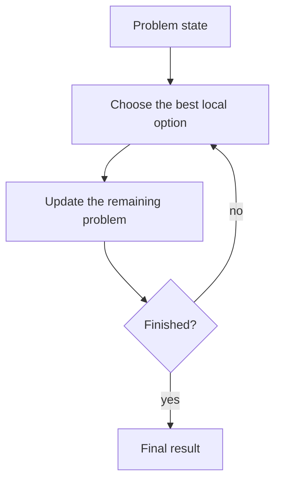
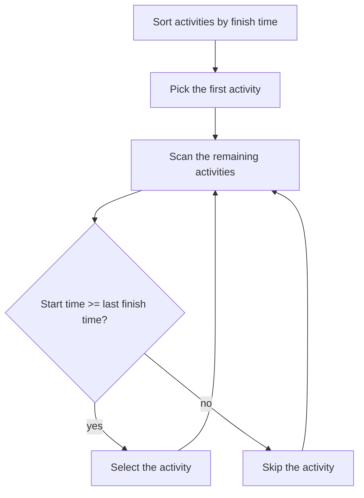
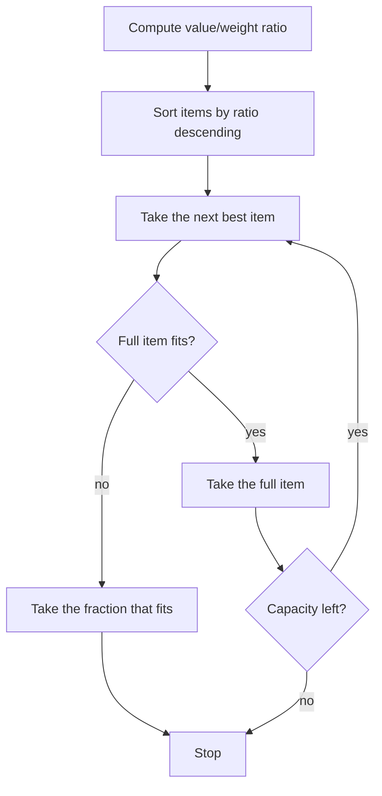

# Week 07 Lecture Notes

## Topic
- Greedy Algorithms

## Learning Goals
- Explain what a greedy algorithm does.
- Distinguish between a local choice and a global result.
- Implement common greedy examples in Python.
- Recognize that greedy does not solve every optimization problem.
- Compare examples where greedy works well and where it can fail.

## In-Class Code References
- `weeks/week-07/src/1-activity_selection.py`
- `weeks/week-07/src/2-coin_change.py`
- `weeks/week-07/src/3-fractional_knapsack.py`

## Why This Week Matters
- Some problems can be solved by making a good choice at each step.
- Greedy algorithms are often shorter and faster than exhaustive methods.
- The challenge is not writing the code. The challenge is knowing when the greedy rule is correct.

## What Is a Greedy Algorithm?
- A greedy algorithm makes the best-looking choice at the current step.
- It does not go back and reconsider old choices.
- It tries to build the final answer piece by piece.

## Key Idea: Local Best Choice
- Greedy algorithms use a **selection rule**.
- That rule tells us which candidate to choose next.
- If the rule matches the structure of the problem, greedy can be correct and efficient.

## Example 1: Activity Selection
- Problem:
  - Choose the maximum number of non-overlapping activities.
- Greedy rule:
  - Always choose the activity that finishes earliest among the remaining compatible activities.
- Why it works well:
  - Finishing earlier leaves more room for later activities.

### Activity Selection Workflow

## Example 2: Coin Change
- Problem:
  - Build a target amount using available coin values.
- Greedy rule:
  - Repeatedly take the largest coin that does not exceed the remaining amount.
- Important note:
  - This rule works for some coin systems, but not all.

### Greedy Coin Change Example
- With coins `[25, 10, 5, 1]`, greedy is usually a good fit.
- With coins `[4, 3, 1]` and amount `6`, greedy chooses `[4, 1, 1]`.
- But `[3, 3]` uses fewer coins.
- So this example shows that greedy can fail if the coin system does not match the rule.

## Example 3: Fractional Knapsack
- Problem:
  - Fill a bag with limited capacity to maximize total value.
- Greedy rule:
  - Always take the item with the highest `value / weight` ratio first.
- Important restriction:
  - This works for **fractional** knapsack because we are allowed to take part of an item.

### Fractional Knapsack Workflow

## When Greedy Works
- A correct greedy rule must match the structure of the problem.
- The current best-looking choice should still allow an optimal final answer.
- Good teaching examples:
  - activity selection
  - fractional knapsack

## When Greedy Fails
- A locally best move may block a better final result.
- Coin change is a classic reminder that greedy is not automatically correct.
- Before trusting a greedy idea, test it against counterexamples.

## Complexity Notes
- Activity Selection:
  - Sorting dominates the runtime: `O(n log n)`
- Coin Change:
  - Depends on the number of coin values and how many coins are chosen
- Fractional Knapsack:
  - Sorting dominates the runtime: `O(n log n)`

## Common Mistakes
- Assuming greedy always gives the optimal answer.
- Choosing a rule without justifying it.
- Forgetting to sort candidates before scanning them.
- Mixing up fractional knapsack with `0/1` knapsack.
- Ignoring counterexamples when testing the idea.

## Homework
- Easy:
  - Apply the activity-selection rule to a list of 5 intervals.
- Moderate:
  - Trace greedy coin change for two different coin systems and compare the results.
- Difficult:
  - Solve one fractional knapsack example by hand and explain each choice with the ratio rule.

## Next Week Topic (Brief)
- Next week can move to dynamic programming, where local greedy choices are not always enough.
