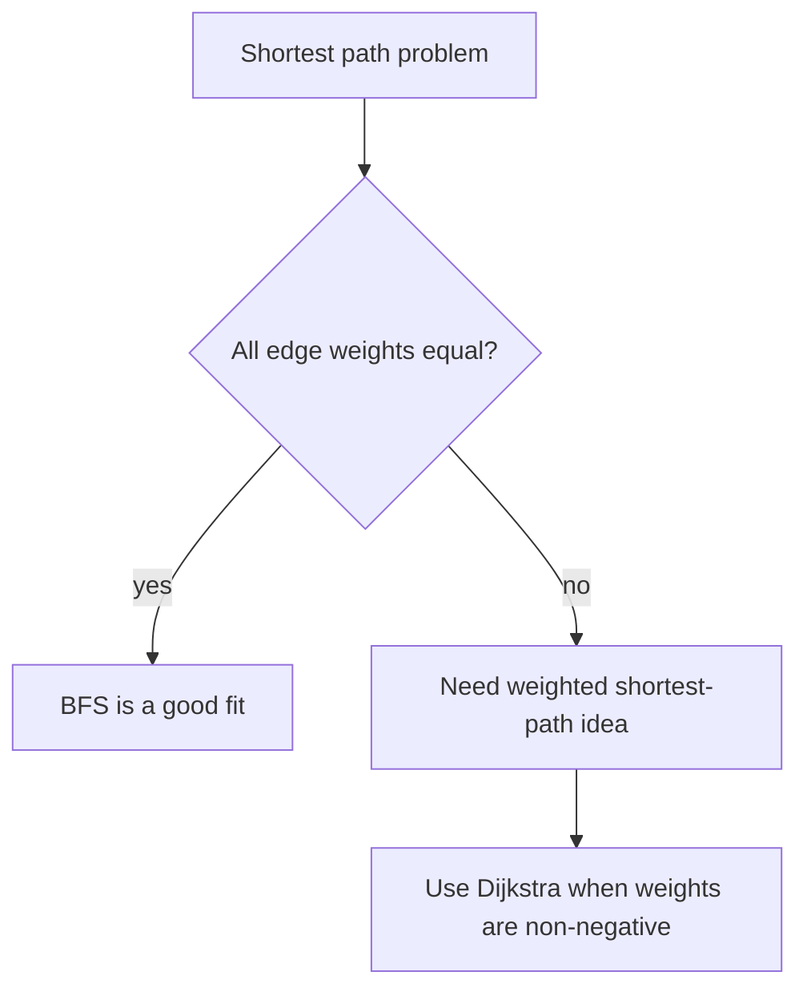
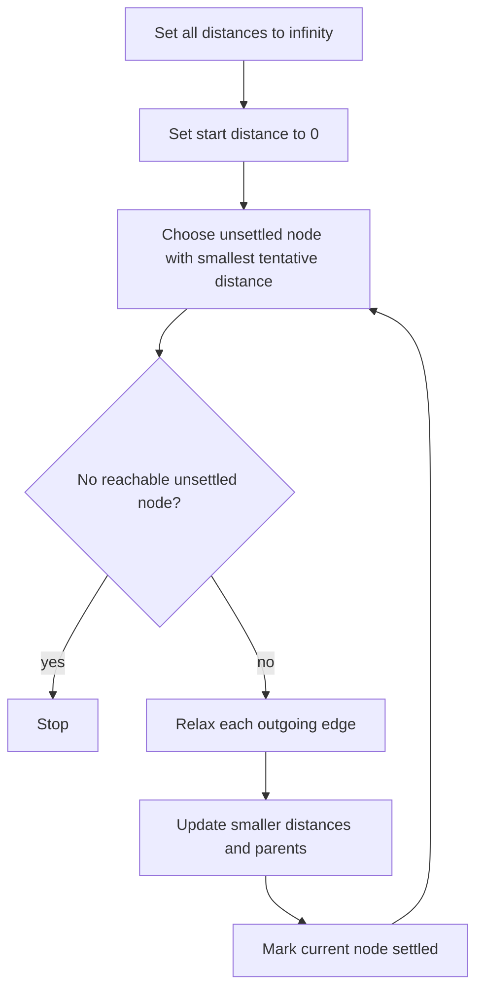

# Week 08 Lecture Notes

## Topic
- Weighted Graphs
- Dijkstra's Algorithm
- Shortest Path Reconstruction

## Learning Goals
- Explain the difference between unweighted and weighted graphs.
- Compute path cost as the sum of edge weights.
- Understand why BFS is not enough when edge costs are different.
- Implement Dijkstra's algorithm in Python.
- Reconstruct one shortest path after computing distances.

## In-Class Code References
- `weeks/week-08/src/1-weighted_graph_basics.py`
- `weeks/week-08/src/2-dijkstra.py`
- `weeks/week-08/src/3-shortest_path_reconstruction.py`

## Why This Week Matters
- In many real problems, edges are not all equal.
- A road can be short or long.
- A network link can be cheap or expensive.
- A route with fewer edges is not always the cheapest route.

## Weighted Graphs
- A weighted graph stores a cost on each edge.
- That cost can represent:
  - distance
  - time
  - money
  - risk

### Core Vocabulary
- `weight`: the cost written on an edge
- `path cost`: the sum of all edge weights on a path
- `shortest path`: the path with minimum total cost

### Weighted Example
- Path `A -> B -> D -> F` might use fewer edges.
- Path `A -> C -> B -> D -> E -> F` might use more edges.
- But the second path can still be cheaper if its total cost is smaller.

## Why BFS Is Not Enough
- BFS works well for shortest path in an **unweighted** graph.
- BFS minimizes the number of edges.
- Dijkstra minimizes the **total edge cost**.
- If edge weights are different, minimizing edge count is not the same as minimizing cost.



## Dijkstra's Algorithm
- Dijkstra solves shortest paths from one start node.
- It assumes edge weights are **non-negative**.
- The main idea:
  - keep the best known distance to each node
  - repeatedly choose the unsettled node with the smallest tentative distance
  - relax its outgoing edges

### Dijkstra Workflow


## Relaxation
- Relaxation means:
  - try a new path through the current node
  - compare it with the old best distance
  - keep the smaller one

### Relaxation Formula
```text
new_distance = distance[current] + weight(current, neighbor)
```

- If `new_distance < distance[neighbor]`, update:
  - `distance[neighbor]`
  - `parent[neighbor]`

## Reconstructing the Path
- Distances tell us the cost.
- Parent pointers tell us the path.
- After Dijkstra finishes:
  - start from the target
  - follow parent pointers backward
  - reverse the result

## Compare: BFS vs Dijkstra
- **BFS**
  - good for unweighted shortest path
  - treats every edge equally
  - uses a queue
- **Dijkstra**
  - good for non-negative weighted shortest path
  - respects edge costs
  - often uses a priority queue

## Complexity Notes
- With adjacency list and heap-based priority queue:
  - Time: `O((V + E) log V)`
  - Space: `O(V + E)`
- With a simple repeated scan for the minimum unsettled node:
  - Time: `O(V^2 + E)`

## Common Mistakes
- Using Dijkstra on graphs with negative edge weights.
- Forgetting that the result depends on total path cost, not edge count.
- Updating distances without updating parents.
- Mixing up “visited once” in BFS with “settled distance” in Dijkstra.
- Forgetting to skip stale entries when using a heap.

## Homework
- Easy:
  - Compute the cost of two different weighted paths by hand.
- Moderate:
  - Run Dijkstra from one start node and write the final distance table.
- Difficult:
  - Reconstruct the shortest path from the start node to every other node.

## Next Week Topic (Brief)
- Next week can move to heaps and priority queues, which support efficient minimum extraction.
